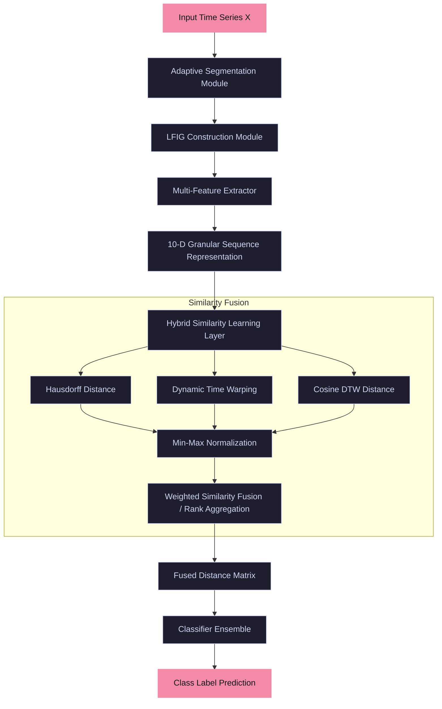

# Methodology Design & System Architecture

This document presents the detailed system architecture, formal mathematical equations, and algorithms for **Adaptive Multi-Feature Linear Fuzzy Information Granulation with Hybrid Similarity Learning for Time Series Classification**.

---

## 1. System Architecture

The following block diagram outlines the flow of a single time series through our system, from raw input to final classification:



---

## 2. Mathematical Equations

Let a time series $X$ of length $N$ be represented as $X = \{x_1, x_2, \dots, x_N\}$.

### 2.1 Adaptive Segmentation
The goal of segmentation is to find a set of $K$ partition points $S = \{t_0, t_1, \dots, t_K\}$ with $1 = t_0 < t_1 < \dots < t_K = N$, dividing $X$ into $K$ non-overlapping segments $I_j = [t_{j-1}, t_j]$ of length $L_j = t_j - t_{j-1} + 1$. We compare three windowing strategies:

1. **Fixed Windowing:**
   $$t_j = j \cdot W \quad \text{for } j = 1, \dots, K-1 \quad (W \text{ is window size})$$

2. **Variance-based Windowing:**
   The segment is extended until the local variance exceeds a threshold $\theta_{var}$:
   $$\text{Var}(I_j) = \frac{1}{L_j} \sum_{i=t_{j-1}}^{t} (x_i - \bar{x}_{I_j})^2 > \theta_{var}$$

3. **Kernel Change Point Detection (CPD):**
   Given a kernel similarity $k(x, y)$, we optimize the partition by minimizing the sum of costs plus a penalty $\beta$:
   $$\min_{t_1, \dots, t_{K-1}} \sum_{j=1}^K C(x_{t_{j-1} : t_j}) + \beta K$$
   where $C$ is the quadratic error cost or the kernel-based variance cost:
   $$C(x_{a:b}) = \sum_{i=a}^b \| \phi(x_i) - \bar{\mu}_{a:b} \|_{\mathcal{H}}^2$$

---

### 2.2 Linear Fuzzy Information Granulation (LFIG)
For each segment $I_j = [t_{j-1}, t_j]$, we compute a linear approximation and its fuzzy envelopes:

1. **Linear Trend Fitting:**
   We represent the time index inside the segment as $\tau \in \{1, 2, \dots, L_j\}$. We fit a line $y(\tau) = a_j \cdot \tau + b_j$ using ordinary least squares:
   $$a_j = \frac{L_j \sum_{\tau=1}^{L_j} \tau \cdot x_{t_{j-1}+\tau-1} - \left(\sum_{\tau=1}^{L_j} \tau\right) \left(\sum_{\tau=1}^{L_j} x_{t_{j-1}+\tau-1}\right)}{L_j \sum_{\tau=1}^{L_j} \tau^2 - \left(\sum_{\tau=1}^{L_j} \tau\right)^2}$$
   $$b_j = \bar{x}_{I_j} - a_j \frac{L_j + 1}{2}$$

2. **Fuzzy Envelopes:**
   Let $e_j(\tau) = x_{t_{j-1}+\tau-1} - (a_j \tau + b_j)$ be the residual at step $\tau$. The residual standard deviation is $\sigma_{e, j}$. The lower bound line $L_j(\tau)$ and upper bound line $U_j(\tau)$ are:
   $$L_j(\tau) = a_j \tau + b_j - z \cdot \sigma_{e, j}$$
   $$U_j(\tau) = a_j \tau + b_j + z \cdot \sigma_{e, j}$$
   where $z > 0$ is a coverage hyperparameter.

---

### 2.3 Multi-Feature Granule Representation
For each segment $I_j$, we construct a 10-dimensional feature vector $\mathbf{f}_j = [f_{j,1}, f_{j,2}, \dots, f_{j,10}]^T$:

1. **Lower Bound ($f_{j,1}$):** $\bar{L}_j = \frac{1}{L_j} \sum_{\tau=1}^{L_j} L_j(\tau) = a_j \frac{L_j + 1}{2} + b_j - z \sigma_{e, j} = \bar{x}_{I_j} - z \sigma_{e, j}$
2. **Upper Bound ($f_{j,2}$):** $\bar{U}_j = a_j \frac{L_j + 1}{2} + b_j + z \sigma_{e, j} = \bar{x}_{I_j} + z \sigma_{e, j}$
3. **Trend Slope ($f_{j,3}$):** $a_j$
4. **Shannon Entropy ($f_{j,4}$):** $H(I_j) = -\sum_{i=1}^B p_i \log_2 p_i$ (where $p_i$ is the bin frequency of $x \in I_j$)
5. **Variance ($f_{j,5}$):** $\sigma^2_j = \frac{1}{L_j} \sum_{i=t_{j-1}}^{t_j} (x_i - \bar{x}_{I_j})^2$
6. **Volatility ($f_{j,6}$):** $\text{Vol}_j = \text{std}(\{x_i - x_{i-1} \mid i = t_{j-1}+1, \dots, t_j\})$
7. **Curvature ($f_{j,7}$):** $c_j$, the quadratic coefficient in $y = c_j \tau^2 + d_j \tau + e_j$
8. **Intercept ($f_{j,8}$):** $b_j$
9. **Energy ($f_{j,9}$):** $\text{Energy}_j = \sum_{i=t_{j-1}}^{t_j} x_i^2$
10. **Skewness ($f_{j,10}$):** $\text{Skew}_j = \frac{1}{L_j \cdot \sigma^3_j} \sum_{i=t_{j-1}}^{t_j} (x_i - \bar{x}_{I_j})^3$

---

### 2.4 Hybrid Similarity and Fusion
Let two granulated time series be $P = \{\mathbf{f}_1^P, \dots, \mathbf{f}_K^P\}$ and $Q = \{\mathbf{f}_1^Q, \dots, \mathbf{f}_M^Q\}$. We calculate three distance matrices:

1. **Hausdorff Distance ($D_H$):**
   Using the bounding intervals $I_k^P = [\bar{L}_k^P, \bar{U}_k^P]$ and $I_m^Q = [\bar{L}_m^Q, \bar{U}_m^Q]$, the distance between two intervals is:
   $$d_{int}(I_1, I_2) = \max(|L_1 - L_2|, |U_1 - U_2|)$$
   The directional Hausdorff distance between sequences $P$ and $Q$ is:
   $$D_H(P, Q) = \max \left( \max_{k} \min_{m} d_{int}(I_k^P, I_m^Q), \max_{m} \min_{k} d_{int}(I_k^P, I_m^Q) \right)$$

2. **DTW on Trend Slopes ($D_{DTW}$):**
   Computes the dynamic time warp alignment between trend slopes $\mathbf{a}^P = \{a_1^P, \dots, a_K^P\}$ and $\mathbf{a}^Q = \{a_1^Q, \dots, a_M^Q\}$ using Euclidean metric:
   $$D_{DTW}(P, Q) = \text{DTW}(\mathbf{a}^P, \mathbf{a}^Q)$$

3. **Cosine DTW ($D_{Cos}$):**
   Computes DTW over the multi-feature sequences using Cosine distance:
   $$d_{cos}(\mathbf{f}_k^P, \mathbf{f}_m^Q) = 1 - \frac{\mathbf{f}_k^P \cdot \mathbf{f}_m^Q}{\|\mathbf{f}_k^P\|_2 \|\mathbf{f}_m^Q\|_2}$$
   $$D_{Cos}(P, Q) = \text{DTW}_{cos}(\mathbf{f}^P, \mathbf{f}^Q)$$

4. **Normalized Similarity Fusion:**
   Let $D^*$ represent a min-max normalized distance matrix: $D^* = \frac{D - \min(D)}{\max(D) - \min(D)}$.
   $$D_{Fused}(P, Q) = w_1 D_H^*(P, Q) + w_2 D_{DTW}^*(P, Q) + w_3 D_{Cos}^*(P, Q)$$
   where $w_1, w_2, w_3 \ge 0$ and $\sum w_i = 1$.

---

## 3. Algorithms & Pseudocode

### Algorithm 1: Adaptive Multi-Feature Granulation
**Input:** Time series $X \in \mathbb{R}^N$, segmentation parameter $\theta_{var}$ or penalty $\dots$, coverage parameter $z$  
**Output:** Granular sequence representation $P \in \mathbb{R}^{K \times 10}$

```python
def adaptive_granulation(X, method="change_point", threshold=0.05, z=1.96):
    # Step 1: Segmentation
    if method == "fixed":
        boundaries = [i for i in range(0, len(X), int(threshold))]
        if boundaries[-1] != len(X):
            boundaries.append(len(X))
    elif method == "variance":
        boundaries = [0]
        start = 0
        for i in range(1, len(X)):
            if np.var(X[start:i+1]) > threshold:
                boundaries.append(i)
                start = i
        if boundaries[-1] != len(X):
            boundaries.append(len(X))
    elif method == "change_point":
        # Using a change point library (e.g., ruptures bottom-up)
        boundaries = detect_change_points(X, penalty=threshold)
    
    # Step 2: Granule construction & Feature Extraction
    P = []
    for j in range(len(boundaries) - 1):
        start, end = boundaries[j], boundaries[j+1]
        segment = X[start:end]
        L = len(segment)
        if L < 3:
            continue # Skip tiny segments
        
        # Fit trend y = a*tau + b
        tau = np.arange(1, L + 1)
        a, b = np.polyfit(tau, segment, 1)
        
        # Compute bounds
        residuals = segment - (a * tau + b)
        sigma = np.std(residuals)
        lower_vals = a * tau + b - z * sigma
        upper_vals = a * tau + b + z * sigma
        
        # Extract features
        f1 = np.mean(lower_vals)
        f2 = np.mean(upper_vals)
        f3 = a
        f4 = compute_shannon_entropy(segment)
        f5 = np.var(segment)
        f6 = np.std(np.diff(segment)) if L > 1 else 0
        
        # Quadratic fit for curvature
        c, d, _ = np.polyfit(tau, segment, 2)
        f7 = c
        f8 = b
        f9 = np.sum(segment**2)
        f10 = scipy.stats.skew(segment) if f5 > 0 else 0
        
        P.append([f1, f2, f3, f4, f5, f6, f7, f8, f9, f10])
        
    return np.array(P)
```

### Algorithm 2: Hybrid Distance Fusion
**Input:** Two granular sequences $P \in \mathbb{R}^{K \times 10}$, $Q \in \mathbb{R}^{M \times 10}$, weights $(w_1, w_2, w_3)$  
**Output:** Fused similarity distance $d_{fused}$

```python
def hybrid_similarity(P, Q, w=[0.3, 0.4, 0.3]):
    # Extract intervals
    I_P = P[:, 0:2] # columns 0 (lower) and 1 (upper)
    I_Q = Q[:, 0:2]
    
    # Hausdorff Distance between intervals
    # d_int(I_k, I_m) = max(|L_k - L_m|, |U_k - U_m|)
    d_H_matrix = np.zeros((len(I_P), len(I_Q)))
    for k in range(len(I_P)):
        for m in range(len(I_Q)):
            d_H_matrix[k, m] = max(abs(I_P[k, 0] - I_Q[m, 0]), abs(I_P[k, 1] - I_Q[m, 1]))
    
    dist_H = max(np.max(np.min(d_H_matrix, axis=1)), np.max(np.min(d_H_matrix, axis=0)))
    
    # DTW on Slopes
    slopes_P = P[:, 2]
    slopes_Q = Q[:, 2]
    dist_DTW, _ = fastdtw(slopes_P, slopes_Q, dist=lambda x, y: abs(x - y))
    
    # Cosine DTW on all features
    dist_Cos, _ = fastdtw(P, Q, dist=cosine_distance)
    
    return dist_H, dist_DTW, dist_Cos
```
